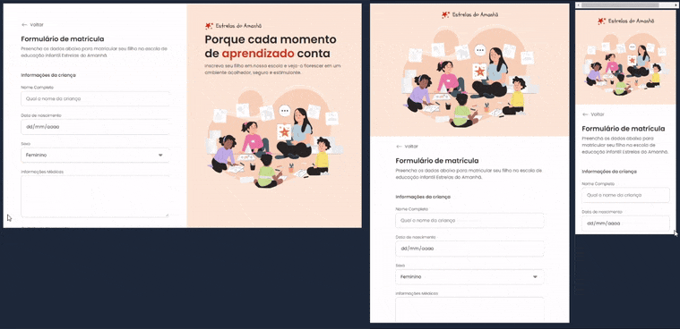

# 💻 Desafio Prático - Responsividade 📲
Desafio prático desenvolvido durante Formação Full-Stack promovida pela Rocketseat
___
### 📂 Repositório dedicado especialmente ao desafio em questão
___
## 📸 Travelgram 📸
  

  
#### 🔎 Você pode conferir o resultado clicando [aqui](https://arturtinoco.github.io/travelgram/) ou acessar o [repositório original do projeto](https://github.com/arturtinoco/travelgram).  
___
## 📰 Portal de Notícias 📰
  

  
#### 🔎 Você pode conferir o resultado clicando [aqui](https://arturtinoco.github.io/portal-de-noticias/) ou acessar o [repositório original do projeto](https://github.com/arturtinoco/portal-de-noticias).  
___
## 📝 Formulário de Matrícula 📝
  

  
#### 🔎 Você pode conferir o resultado clicando [aqui](https://arturtinoco.github.io/formulario-de-matricula/) ou acessar o [repositório original do projeto](https://github.com/arturtinoco/formulario-de-matricula).  
___
  
### 🤖 Tecnologias e Recursos  
  
As tecnologias e recursos listados abaixo foram utilizados no desenvolvimento de todos os projetos deste repositório.  
  
* HTML
* CSS
* Git
* Figma
* Notion  
* Responsively App